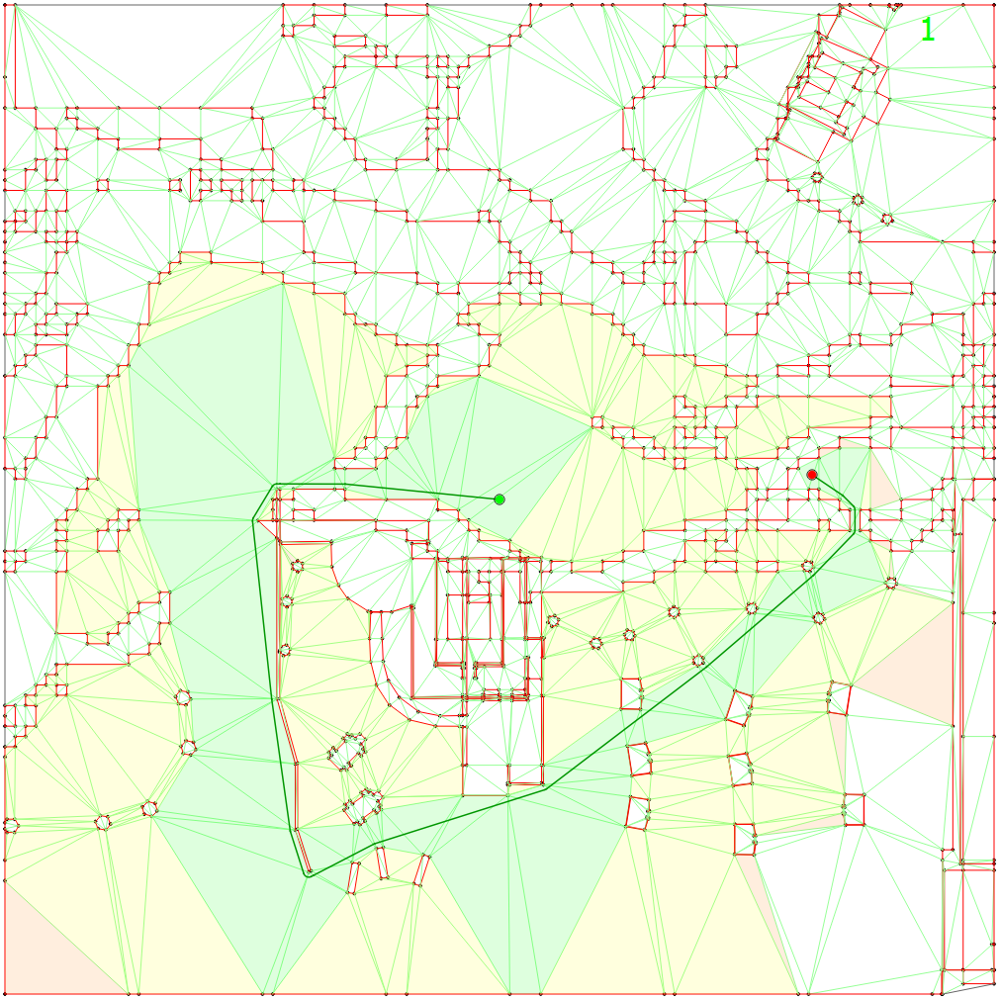

# Pathfinder

Pathfinder is a C++17 library for finding the shortest path (for a circular agent with a specified radius) between two points in a 2d world. The 2d world is given as vertices and line segments representing the constraints of the environment (e.g. walls). This library uses [Jonathan Shewchuk's amazing Triangle library](https://www.cs.cmu.edu/~quake/triangle.html) in order to create a Constrained Delaunay Triangulation of the given world. Once the triangulation (navmesh) is created, an A*-based search algorithm is run to either find a very good path quickly or a globally optimal path at the cost of more CPU time. Most of the pathfinding algorithm concepts come from [Douglas Demyen's Efficient Triangulation-Based Pathfinding](https://skatgame.net/mburo/ps/thesis_demyen_2006.pdf). I've also written [a Qt desktop application](https://github.com/SandSnip3r/Pathfinder-Visualizer) that allows you to play around visual feedback.

<p align="center">
  
</p>

## Getting Started

These instructions will help you to build this library and link it against your own projects.

### Prerequisites

This project requires C++17 (though it could be converted to C++14 without much effort) and CMake >= 3.16.

### Building

1. Create a build directory somewhere (e.g. in a directory beside this one)

```bash
cd ../
mkdir build
cd build
```

2. Run CMake to generate Makefiles

```bash
cmake ../Pathfinder/
```

3. Build using Make

```bash
make
```

This will create a static library `libpathfinder.a` for you to link to your existing project. If necessary, you can modify [CMakeLists.txt](./CMakeLists.txt) to change this to produce a dynamically linked library or an interface library.

### Usage

Please see the [Wiki](https://github.com/SandSnip3r/Pathfinder/wiki) for details on the API.

## Known Issues

- The A* heuristic is not perfect
  - This can be worked around by applying heuristic scaling, though performance degredation is a risk
- There are no checks for whether the specified start or goal position are valid
  - i.e. the agent may be too large to fit in the chosen start or goal location
  - This will result in potentially weird and/or invalid paths
- The check to see if the agent can fit through a corridor is weak
  - This can result in paths that an agent cannot actually fit through
- The pathfinding algorithm is not perfect. The algorithm calculates the g-value of a triangle as the shortest distance in order to reach that triangle. This doesnt always work, especially when the goal is on the other side of the triangle. By that, I mean that it might make sense to take one path to reach the closest point of a triangle, but it might be better to take a completely different path to get to the goal within that triangle. I'm actually not yet sure how to overcome this. Perhaps moving to the Polyanya algorithm would be a good decision.

## Future Work

- Demyen's paper is primarily about pathfinding on an abstract graph that exists a level above the geometry-based triangle navmesh. The goal is to use this heirarchical pathfinding to greatly reduce the complexity.
- Tests, tests, tests!

## Contributing

Please read [CONTRIBUTING.md](./CONTRIBUTING.md) for details on the process for submitting pull requests to us.

## Reporting Bugs

If you find a bug, please open an issue or get in contact with me. I would also likely need your input triangulation as well as start & goal points. I'll solve it as quickly as I can.

## Authors

- Victor Stone

## Acknowledgments

Huge thanks to:

- Jonathan Shewchuk for the incredibly fast and efficient Triangle library
- Douglas Demyen for a great collection and explanation of pathfinding techniques
